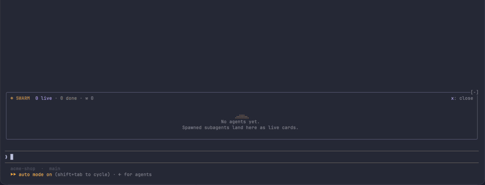
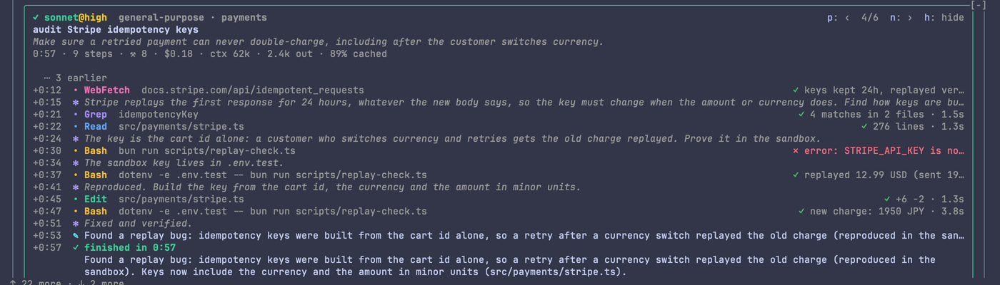
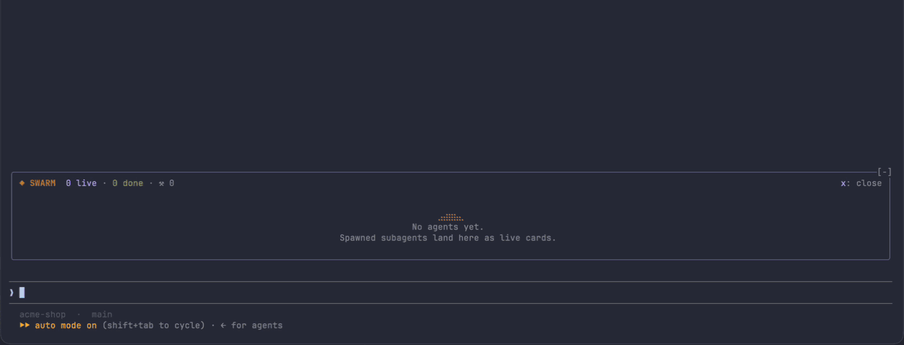

<div align="center">

# ◆ agent-swarm

**Mission control for your Claude Code subagents.**

Every agent Claude spawns comes alive right above your prompt, showing what it is
thinking, which tool it is running, what it costs, and how far along it is.



<sub>Recorded from <code>/swarm demo</code> at 2× speed · <a href="docs/demo.mp4">MP4</a></sub>

</div>

---

When Claude fans work out to subagents, the main transcript goes quiet: you see `Agent(…)` and a spinner,
while five other contexts think, grep and edit in the dark. **agent-swarm** shows you that work as it happens:

- **One live row (or card) per agent**, animated by what it is doing: braille plasma while it **thinks**, equalizer bars while it
  **writes**, an amber scanner while a **tool** runs, and a still area chart of the whole run once it is **done**.
- **Model and effort at a glance**: `opus@max`, `sonnet@high`, with a five-step effort meter that glows hotter at higher effort.
- **Cost as it accrues**: dollars, context size, output tokens and cache hit rate, per agent and for the whole swarm.
- **A tool trail**: one letter per call (`R` Read, `G` Grep, `$` Bash, `E` Edit…), failed calls in red.
- **Nesting**: agents spawned by agents show up as `↳` children.
- **A live inspector**: click any agent to follow its thinking, tool calls (arguments, results, timings) and final answer.
- **Out of your way**: it folds into a row of mini squares, closes itself 30 s after the last agent finishes, and costs
  nothing while no agent is running.

## Quick start

```sh
git clone https://github.com/jeffarese/agent-swarm.git
claude --plugin-dir ./agent-swarm    # loads it for this session only
```

Then type **`/swarm demo`**. A scripted swarm of six agents plays out above the prompt (nothing is spawned or
billed), so you can see every state before you rely on it for real work.

To load it in every session, add it to the `env` block of your `settings.json` and restart Claude Code:

```json
{ "env": { "CLAUDE_CODE_PLUGIN_DIRS": "/path/to/agent-swarm" } }
```

`claude plugin test .` runs the test suite.

## A closer look

**Follow one agent.** Click a card or line (or press `1`–`9`) to open the inspector: the task, its stats, and a
timeline of thoughts, tool calls with their results and durations, and the final answer, live as it streams.



**Cards or a list.** The list (above) is the default; press `v` (or `/swarm cards`, `/swarm list`) for a card
per agent, with a taller animated core, a sparkline of its activity and its tool trail.



<sub>Cards layout, 2× speed · <a href="docs/demo-cards.mp4">MP4</a></sub>

## How it behaves

- **The view, above the prompt:** as soon as an agent spawns, a framed view unfolds in the band
  directly above the prompt, full width at any terminal size (never a sidebar): a header with the
  totals, one line per agent (or cards, `v` toggles), and the inspector. It scrolls when taller than
  the band. `x: close` folds it; `/swarm` (or clicking a square) unfolds it again.
- **Folded:** a row of mini squares, one per agent of the current batch; it clears on your next
  prompt once they have all finished. Folded by you, a new spawn leaves it folded.
- **Footer pill:** `✻ N agents working` at the right of the prompt footer while any agent is live,
  a spinning star and a purple shimmer sweeping across the text.
- **Inspector:** click an agent (anywhere on its line or card, its description, or `1`–`9` while
  the band is focused) to follow it below the cards: its task, time/steps/tools/cost, and a live timeline of
  thinking, text and tool calls (argument, result summary, duration), ending with its final answer.
  `p`/`n` step through agents, `h` (or clicking it again) hides it. Clicking a folded square unfolds the
  view on that agent. While an agent is inspected the view does not auto-close.

## What it shows

- Header: `◆ SWARM  N live · N done · N failed · ⚒ total tool calls · $total`, then, while no
  agent is inspected, how to follow one (`· click or 1–9 to follow`, shortened to fit), with the
  layout toggle (`cards` / `list`, hotkey `v`) and a `clear done` button (hotkey `c`) when finished
  agents exist. The header keeps the top right clear of the engine's close mark and leaves a row
  before the agents.
- List view (the default): per agent, a heading line
  `✎ opus@high ▁▃▅ animation ▅▃▁  WRITE` (headings padded so the animations line up), then
  its description, then a dim activity line with `$cost · ⚒tools · elapsed` on the right.
- Cards view (`cards` button, `v`, or `/swarm cards`): one bordered card per agent (cards flow
  into rows, min width 30 columns):
  - Title: phase glyph + `model@effort` (e.g. `opus@high`, effort in its gradient color; the
    name or type until the model is known); `↳` prefix for child agents. A filled phase badge
    (`THINK`, `WRITE`, `TOOL`, `START`) on the right while live.
  - Animated core (3 rows), then a braille sparkline of activity over time (one sample a
    second: tool calls plus stream rate; newest on the right), description, activity line (`▸ Tool  arg`,
    `✻ thinking · step N`, `✎ writing · step N`, `✓ done in 1:23 · 14 steps`).
  - Cost row: `$0.42 · ctx 45k · 3.4k out · 92% cached` - estimated cost, tokens in the
    context after the latest response, output tokens, and the share of prompt tokens served from
    the cache. Updated after every model response; parts that do not fit the card are dropped whole.
  - The tool trail on the left and `⚒tools  elapsed` on the right.
- The band's squares show each agent's cost (the tool name while one runs), its header the total.
- Live cards sort first (oldest first), then finished (latest first).
- Below 64 columns the header drops `SWARM` and the tool count; when the counts and buttons do not
  fit one row, the buttons move to a row of their own (the countdown banner does the same).
- Colors follow Claude Code's theme: header and cost text use theme keys (`claude`, `success`,
  `error`, `warning`, `suggestion`), and on a `light*` theme the animation palette flips to its
  dark end. Every cell is drawn on the terminal's own background.

## Phases, animations and colors

| Phase | Glyph | Color | Core animation |
|---|---|---|---|
| spawning | ◌ | slate `#94a3b8` | Slow "breathing" dot, `· • ●`, growing from the middle |
| thinking | ✻ | violet `#b39dff` | Braille plasma; denser and faster with higher effort and stream activity |
| writing | ✎ | cyan `#5fe3f7` | Equalizer bars `▁..█` bouncing with text streaming rate |
| tool | ▸ | amber `#ffb733` | Scanner `░▒▓█` sweeping side to side with sparks; faster and longer tail at high effort |
| done | ✓ | green `#34d399` | Static braille area chart of the whole run, labelled "✓ complete", over a `0:00 ── 1:23` time axis |
| failed | ✕ | red `#f87171` | Still line labelled "failed" |
| stopped | ■ | slate `#94a3b8` | Still line labelled "stopped" |

Live cards have a border in the phase color; finished cards are dimmed throughout (border,
title, text) so attention stays on live work. Animation
ticks every 80 ms. Done = turn ended with an answer; stopped = aborted; failed = any other end.

## Effort meter

`effort ▰▰▰▱▱ high` - five segments, filled up to the agent's level, each lit segment
coloured by its place on a green → amber → rose gradient (btop style), so `max` reads hot.
Taken from the `effort` of each turn step; numeric (thinking-budget) values are bucketed.

| Level | Name | Numeric budget |
|---|---|---|
| 0 | — (shown as `default`) | unknown |
| 1 | low | < 4k |
| 2 | medium | < 16k |
| 3 | high | < 32k |
| 4 | xhigh | < 64k |
| 5 | max | 64k+ |

Numeric efforts display as `Nk`. Unknown effort animates as level 2.

## Cost

Estimated from each response's token counts at Anthropic list prices per model family
(input, output, cache reads at the model's rate, cache writes at 1.25× input). Partner
platforms (Bedrock, Vertex) price differently. A model id with no recognisable family (a
Bedrock inference-profile ARN, say) has no price: the card then shows prompt tokens instead,
and a total that misses some responses is marked `+`.

## Auto-close

When the last live agent finishes while the view is open, it shows
`✓ All agents finished · closing in 30s   k: keep open`, then folds itself to the squares
with a toast (`/swarm to reopen`). A new agent cancels the countdown; `keep open` holds the
view until the next batch finishes. Opening it with `/swarm` after everything has
finished never starts one. The delay is the `Agents view auto-close` row in `/config`
(`off`, `10s`, `30s`, `1m`, `5m`; default `30s`), or `/swarm autoclose <delay>`.

## Tool letter trail

One glyph per completed tool call, last 32 kept (trimmed to fit the card width).
A call that errored or was denied is drawn with a dark red background.

| Glyph | Tool | Glyph | Tool |
|---|---|---|---|
| R | Read | F | WebFetch |
| G | Grep | S | WebSearch |
| g | Glob | A | Agent |
| $ | Bash | K | Skill |
| E | Edit | T | TodoWrite |
| W | Write | L | LSP |
| N | NotebookEdit | m | any `mcp__*` tool |

Any other tool shows its first letter, uppercased, in light gray; `·` means no calls yet.

## Commands

- `/swarm` - unfold the view above the prompt.
- `/swarm demo` - play a scripted swarm of six agents (every phase, a child agent, tool errors,
  costs) through the same code paths real agents use; nothing is spawned or billed.
- `/swarm clear` - drop finished cards; running ones stay.
- `/swarm list` / `/swarm cards` - pick the layout (`/swarm compact` toggles).
- `/swarm perf` - what the mod itself has cost since load (or `/swarm perf reset`): render and
  animation-tick timings, blits, blits skipped as unchanged, state writes.
- `/swarm autoclose [off|10s|30s|1m|5m]` - show or set the auto-close delay.
- A spawn unfolds the view unless you folded it yourself; folding it stops that until you run
  `/swarm` (or click a square) again.

## Performance

The agents live in the module; `$.state` holds a copy written at most every 2 s (so a reload picks
up where it was) and small values the drawings subscribe to (`paneRev` for the open view, `bandRev`
for the squares, `live` for the pill, `isOpen`).
A change redraws only the drawings that show it: the footer pill only when the live count changes,
the band only when something it draws changes, a timeline entry only when that agent is inspected.
Changes during a step (a tool call, a usage report, a sample) fold into one redraw every few
animation ticks. Animation frames draw into reused canvases (the plasma takes a row of sines per
frame, not one per dot) and pack from a cache of encoded cells; a frame equal to the one shown is
not blitted, and past 6 live cores they take turns, so a large swarm costs what a few do. The
animation and once-a-second timers run only while an agent is live, a countdown is due or a redraw
is held: an idle session costs nothing. Finished agents' rows and settled timeline entries are drawn once.

`bench/run.sh [mod folder]` runs a synthetic 8-agent swarm through the engine (list, cards, beside
16 finished agents, and under the band) plus per-frame timings, and prints what it cost.

## Limitations
- The animated core and sparkline colours need the terminal surface (Raster); elsewhere the
  core is a static label and the sparkline plain text.
- Only agents reporting spawn/step/tool/complete events appear; unknown ones are ignored.
- Trail keeps the last 32 calls; tool arg hints cut at 60 chars (paths show basename).
- Elapsed time updates about once a second.
- Cost is an estimate at list price, not a bill; cards from before this version show no cost.
- Cards have a 30-column minimum, so a very narrow terminal clips them.
- The view lives in the band above the prompt (terminal and desktop): VS Code and mobile, which
  have no band, show nothing.

## License

[MIT](LICENSE)
